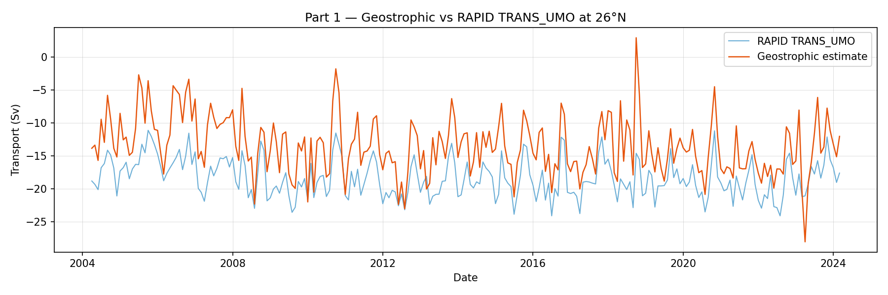
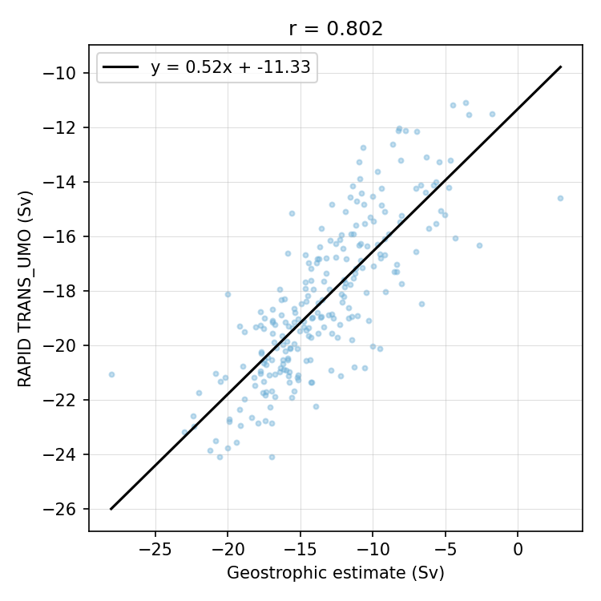
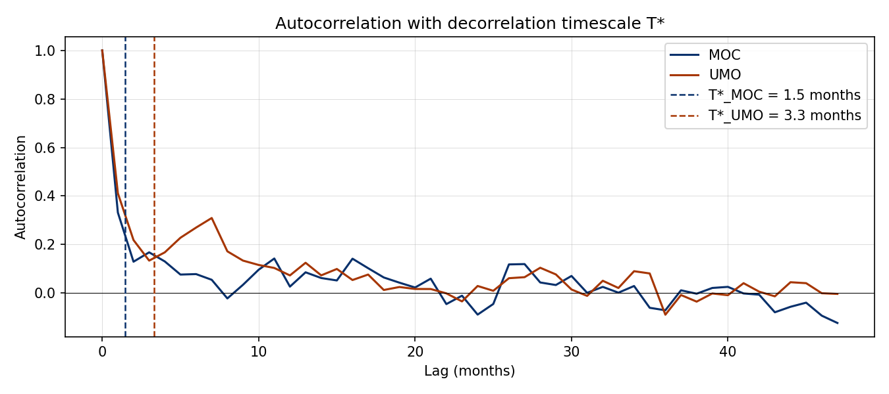
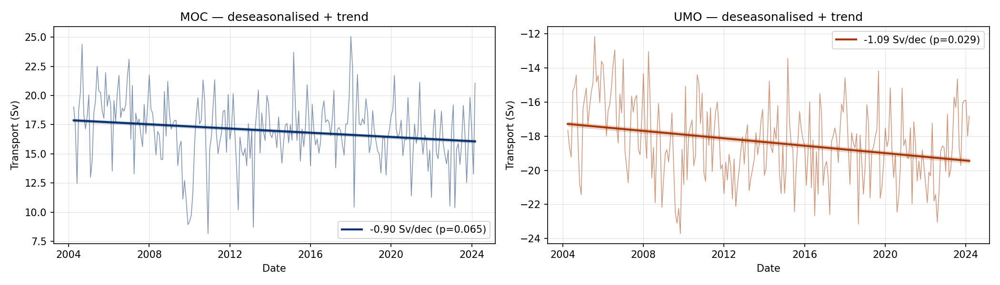
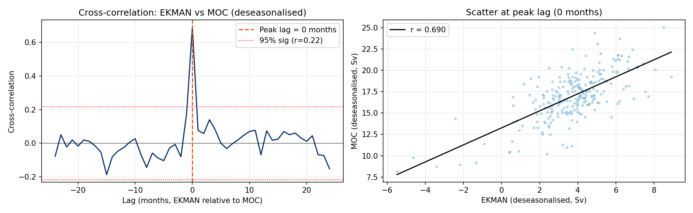
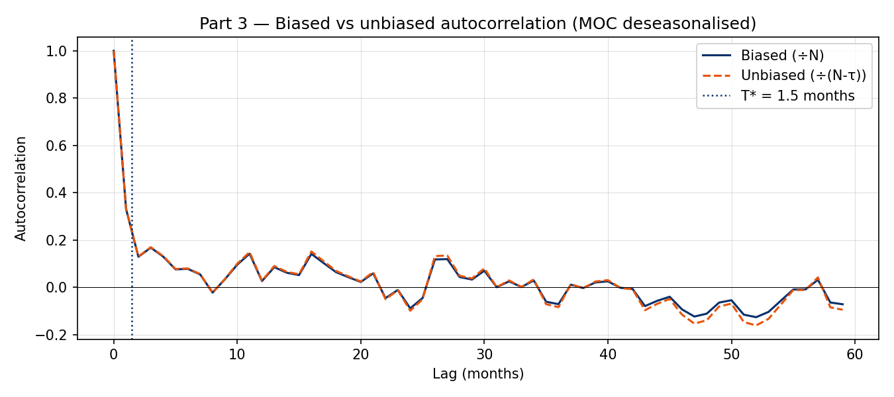

# Assignment 2 — Geostrophic Transport and AMOC Time Series

**Student:** Amparo | **Dataset:** RAPID 26°N (April 2004 – March 2024)

## Part 1 — Geostrophic Transport

**Dataset:** RAPID 26°N boundary hydrography (`ts_gridded.nc`), 14,599
profiles every 12 hours at the western (76.74°W) and eastern (16.23°W)
boundaries, April 2004 – March 2024.

To compute the geostrophic transport I followed the steps described in
McCarthy et al. (2015). Since the geostrophic balance arises from a
density difference between the east and west sides of the basin,
temperature and salinity profiles at both boundaries are required. Using
the `gsw` package I obtained Conservative Temperature and Absolute
Salinity. I then computed the dynamic height anomaly at each boundary,
and dividing the east-west difference by the Coriolis parameter f gives
the geostrophic transport per unit depth. Finally, I integrated the
transport down to 1100 m, the depth at which the AMOC reaches its maximum.

The geostrophic transport estimate has a mean of −13.5 Sv and a standard
deviation of 5.5 Sv. Compared to the official RAPID TRANS_UMO product
(mean: −18.4 Sv), my result is less negative — less southward flow than
the official product. The correlation between the two monthly-averaged
series is r = 0.80, consistent with the value of 0.77 reported by
McCarthy et al. (2015).

The regression slope of 0.52 shows that our estimate has almost twice
the variance of the official product, meaning our estimate captures the
variability correctly but does not reproduce all the corrections applied
in the final product.

## Part 2A — Seasonal Cycle and Trend Analysis

**Series:** MOC and TRANS_UMO at 26°N, monthly averages,
April 2004 – March 2024 (N = 242 months).

The MOC has a seasonal cycle of ~5 Sv amplitude, with a minimum of
14.7 Sv (weak Ekman transport and shallow thermocline stratification)
and a maximum of 19.7 Sv (stronger trade winds). The MOC has
T* = 1.5 months and N_eff = 82, while the UMO is more persistent:
T* = 3.3 months and N_eff = 36.

| Series | Slope (Sv/decade) | SE naive | SE honest | t_eff | p_eff | Significant? |
|--------|------------------|----------|-----------|-------|-------|--------------|
| MOC    | −0.90            | 0.31     | 0.48      | −1.87 | 0.065 | No (95%)     |
| UMO    | −1.09            | 0.25     | 0.49      | −2.23 | 0.029 | Yes (95%)    |

## Part 2B — Cross-correlation: TRANS_EKMAN vs MOC

**Pair:** TRANS_EKMAN and MOC at 26°N, monthly deseasonalised averages.

The EKMAN-MOC pair was chosen because the Ekman transport is one of the
direct components of the MOC. A cross-correlation of r = 0.69 is obtained
at lag = 0 months, meaning both series vary simultaneously. With
N_eff ≈ 36, the 95% significance threshold is r ≈ 0.33, so the
relationship is statistically significant.

## Part 3 — Biased vs Unbiased Autocorrelation

The biased autocorrelation is normalised by N (total number of data
points), and the unbiased by N−τ (number of available pairs at each lag).
At small lags there is virtually no difference between the two estimators.
However, at large lags the unbiased estimator produces unstable values,
while the biased estimator naturally damps the tail toward zero.

